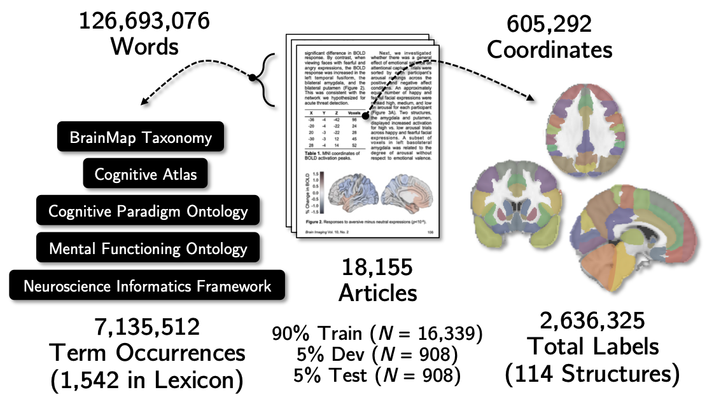
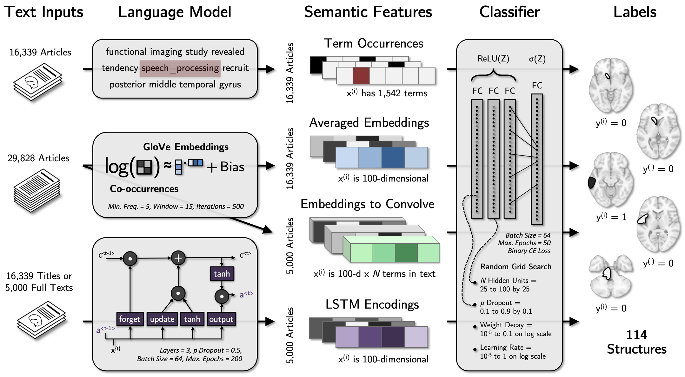
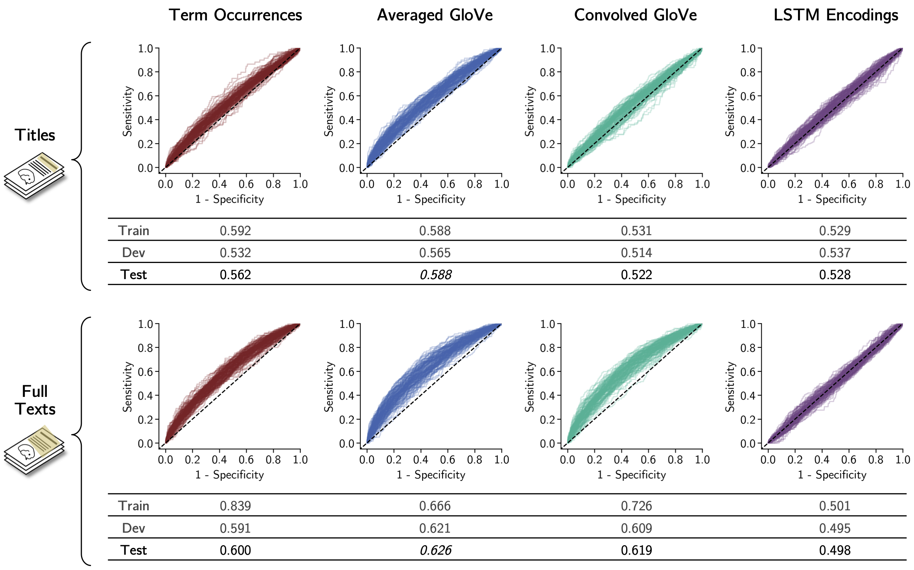

# A computational knowledge engine for human neuroscience

### By Ellie Beam, Stanford University, Department of Psychiatry and Behavioral Sciences

### Final project for Deep Learning (CS 230)

Most mental functions were defined decades ago in psychology before it could be known how they related to brain activity. Here, deep learning is applied to assess how strongly mental functions in human neuroimaging article texts predict spatial locations of brain activity. Several sets of semantic features are compared including term occurrences, embeddings, and context encodings of the titles and full texts. The results support averaging the embeddings of mental function terms in the full text as input for this classification task. Among the top-performing classifiers, feature maps for each brain region lend insight into which mental functions most strongly predict activation across the literature.

# Dataset 

<!--  -->

## Text inputs

Studies were combined from BrainMap, Neurosynth, and accessible journals. Either the title or full text was taken as input. Preprocessing included lowercasing, lemmatization with WordNet, stop word removal, and combination of n-grams from a lexicon of terms for mental functions.

## Neural outputs

Spatial coordinates represent locations in the brain that were found to be statistically related to mental function by fMRI or PET imaging. Coordinates reported in Talairach space were converted to MNI, then mapped to a whole-brain neuroanatomical atlas. 

# Features & Models

The semantic content of articles was represented by applying one of four language models to terms for mental functions in article titles or texts. Language model outputs served as inputs to a neural network classifier predicting whether a coordinate was reported in each structure of a neuroanatomical atlas.

# Results

The highest area under the receiver operating characteristic curve (ROC-AUC) in the test set was achieved by averaging GloVe embeddings. Except for LSTM, full texts had superior performance to titles. 

